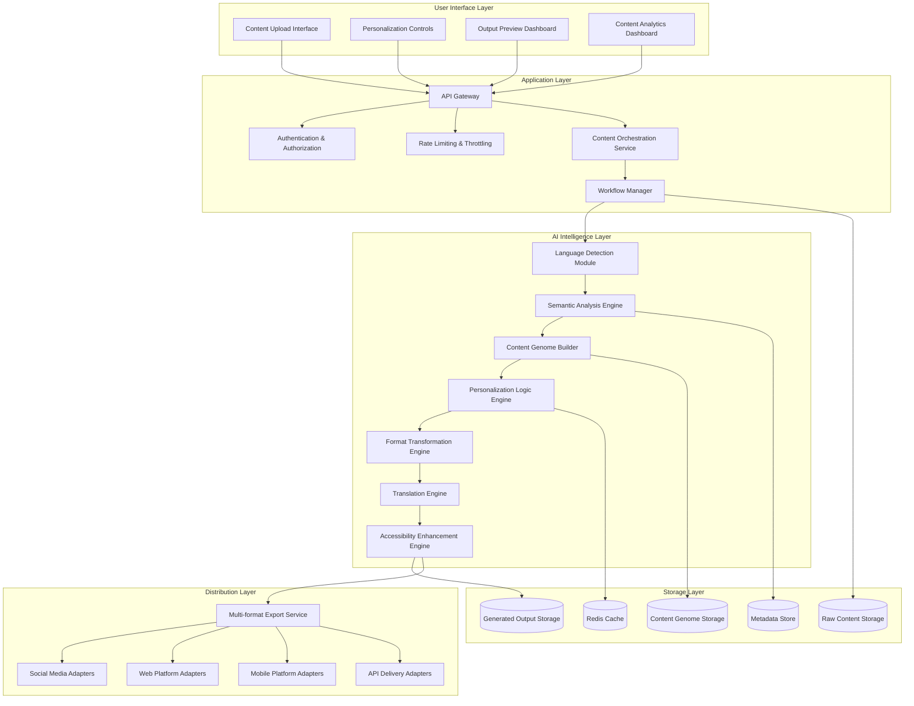
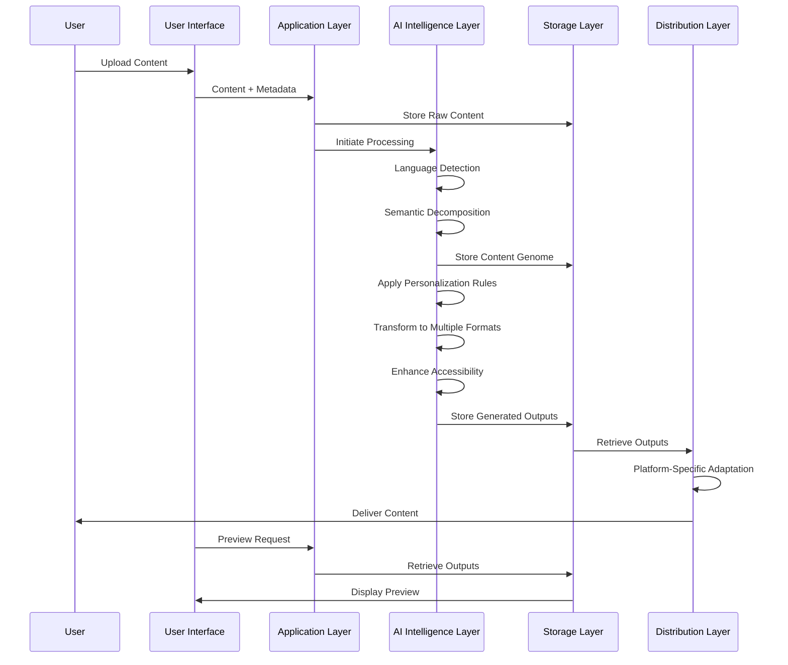

# Design Document: BharatContent AI

## Overview

BharatContent AI is an AI-driven digital content intelligence platform that transforms how content is created, managed, and distributed across diverse audiences and formats. The platform implements a Content Genome approach, decomposing digital content into semantic units (meaning, intent, emotion, topic, context) and dynamically recomposing them based on user context.

The system architecture follows a microservices pattern to ensure scalability, fault tolerance, and modularity. Each AI processing component operates as an independent service, enabling seamless scaling based on workload and independent evolution of AI capabilities.

Key architectural principles:
- **Semantic-First Design**: Content is treated as structured semantic data rather than flat text
- **Modular AI Pipeline**: Each processing stage is independently scalable and replaceable
- **Context-Aware Processing**: All transformations consider audience, platform, and cultural context
- **Accessibility by Design**: All outputs prioritize accessibility and inclusive design

## Architecture

### Layered System Architecture

The BharatContent AI platform follows a modular, layered architecture that separates concerns and enables independent scaling of each layer. The architecture is designed for loose coupling, fault tolerance, and horizontal scalability.



### Data Flow Architecture

The system processes content through a well-defined pipeline that transforms raw input into personalized, multi-format outputs:



### Service Communication Patterns

The architecture employs multiple communication patterns optimized for different use cases:

1. **Synchronous API Calls**: For real-time operations like content preview and validation
2. **Asynchronous Message Queues**: For heavy processing tasks like semantic analysis and content transformation
3. **Event-Driven Architecture**: For workflow orchestration and status updates
4. **Streaming**: For large file processing and real-time content delivery

### Design Principles

#### Loose Coupling
- **Interface-Based Design**: All AI modules communicate through well-defined interfaces
- **Dependency Injection**: Services are injected rather than hard-coded, enabling easy swapping
- **Event-Driven Communication**: Services communicate through events rather than direct calls
- **API Versioning**: Backward-compatible APIs ensure smooth upgrades

#### AI Model Swappability
- **Plugin Architecture**: AI models are implemented as pluggable components
- **Model Registry**: Centralized registry for managing different AI model versions
- **A/B Testing Framework**: Built-in capability to test different models simultaneously
- **Graceful Fallbacks**: Automatic fallback to alternative models when primary models fail

#### Horizontal Scalability
- **Stateless Services**: All processing services are stateless for easy horizontal scaling
- **Load Balancing**: Intelligent load distribution across service instances
- **Auto-Scaling**: Automatic scaling based on workload and performance metrics
- **Resource Isolation**: Each service has dedicated resource pools

#### Fault-Tolerant Processing Pipeline
- **Circuit Breakers**: Prevent cascade failures across services
- **Retry Mechanisms**: Exponential backoff for transient failures
- **Dead Letter Queues**: Handle failed messages gracefully
- **Health Monitoring**: Continuous health checks and automatic recovery

### Future Extension Architecture

The architecture is designed to accommodate future enhancements:

#### Feedback-Driven Content Optimization


#### Voice-Based Content Input
- **Speech Recognition Module**: Convert voice input to text
- **Voice Semantic Analysis**: Extract meaning from speech patterns
- **Multi-Modal Processing**: Combine voice, text, and visual inputs

#### Offline-First Delivery Modes
- **Content Synchronization**: Sync content for offline access
- **Progressive Web App**: Offline-capable web interface
- **Mobile SDK**: Native mobile apps with offline capabilities

## Components and Interfaces

### User Interface Layer Components

#### Content Upload Interface
**Responsibilities:**
- Provide intuitive drag-and-drop content upload
- Support multiple file formats (text, audio, video)
- Real-time upload progress and validation feedback
- Batch upload capabilities for multiple files

**Key Interfaces:**
```typescript
interface ContentUploadInterface {
  uploadSingle(file: File, metadata: UploadMetadata): Promise<UploadResult>
  uploadBatch(files: File[], metadata: BatchMetadata): Promise<BatchUploadResult>
  validateFile(file: File): Promise<ValidationResult>
  getUploadProgress(uploadId: string): Promise<ProgressStatus>
}
```

#### Personalization Controls
**Responsibilities:**
- Configure audience demographics and preferences
- Set platform-specific requirements
- Define content transformation parameters
- Manage personalization templates

**Key Interfaces:**
```typescript
interface PersonalizationControls {
  createProfile(profile: PersonalizationProfile): Promise<ProfileId>
  updateProfile(profileId: ProfileId, updates: ProfileUpdate): Promise<void>
  getAvailableTemplates(): Promise<PersonalizationTemplate[]>
  previewPersonalization(contentId: ContentId, profileId: ProfileId): Promise<PreviewResult>
}
```

#### Output Preview Dashboard
**Responsibilities:**
- Display generated content in multiple formats
- Show semantic accuracy metrics
- Provide personalization effectiveness scores
- Enable content comparison and selection

**Key Interfaces:**
```typescript
interface PreviewDashboard {
  getContentPreview(contentId: ContentId, format: ContentFormat): Promise<PreviewData>
  getSemanticMetrics(contentId: ContentId): Promise<SemanticMetrics>
  getPersonalizationScores(contentId: ContentId): Promise<PersonalizationScores>
  compareVersions(contentIds: ContentId[]): Promise<ComparisonResult>
}
```

### Application Layer Components

#### Content Orchestration Service
**Responsibilities:**
- Coordinate the entire content processing pipeline
- Manage workflow state and transitions
- Handle error recovery and retry logic
- Provide real-time status updates

**Key Interfaces:**
```typescript
interface ContentOrchestrationService {
  initiateProcessing(contentId: ContentId, workflow: WorkflowDefinition): Promise<ProcessingId>
  getProcessingStatus(processingId: ProcessingId): Promise<ProcessingStatus>
  pauseProcessing(processingId: ProcessingId): Promise<void>
  resumeProcessing(processingId: ProcessingId): Promise<void>
  cancelProcessing(processingId: ProcessingId): Promise<void>
}
```

#### Workflow Manager
**Responsibilities:**
- Define and execute content processing workflows
- Manage dependencies between processing steps
- Handle conditional logic and branching
- Provide workflow templates and customization

**Key Interfaces:**
```typescript
interface WorkflowManager {
  createWorkflow(definition: WorkflowDefinition): Promise<WorkflowId>
  executeWorkflow(workflowId: WorkflowId, context: WorkflowContext): Promise<ExecutionResult>
  getWorkflowTemplates(): Promise<WorkflowTemplate[]>
  validateWorkflow(definition: WorkflowDefinition): Promise<ValidationResult>
}
```

### AI Intelligence Layer Components

#### Language Detection Module
**Responsibilities:**
- Automatically identify primary and secondary languages in content
- Provide confidence scores for language detection
- Handle multilingual content scenarios
- Support custom language models

**Key Interfaces:**
```typescript
interface LanguageDetectionModule {
  detectLanguage(content: string): Promise<LanguageDetectionResult>
  detectMultipleLanguages(content: string): Promise<MultiLanguageResult>
  setCustomModel(modelId: string): Promise<void>
  getDetectionConfidence(content: string, language: LanguageCode): Promise<number>
}
```

#### Semantic Analysis Engine
**Responsibilities:**
- Extract semantic meaning using advanced NLP models
- Identify intent patterns and emotional context
- Categorize topics and themes
- Generate semantic embeddings for similarity analysis

**Key Interfaces:**
```typescript
interface SemanticAnalysisEngine {
  analyzeContent(content: ProcessedContent): Promise<SemanticAnalysis>
  extractEntities(content: ProcessedContent): Promise<EntityExtractionResult>
  analyzeSentiment(content: ProcessedContent): Promise<SentimentAnalysis>
  generateEmbeddings(content: ProcessedContent): Promise<SemanticEmbedding[]>
  setAnalysisModel(modelType: ModelType, modelId: string): Promise<void>
}
```

#### Content Genome Builder
**Responsibilities:**
- Create structured Content Genome representations
- Establish relationships between semantic units
- Maintain version control and lineage
- Optimize genome structure for query performance

**Key Interfaces:**
```typescript
interface ContentGenomeBuilder {
  buildGenome(semanticAnalysis: SemanticAnalysis): Promise<ContentGenome>
  updateGenome(genomeId: GenomeId, updates: GenomeUpdate): Promise<ContentGenome>
  optimizeGenome(genomeId: GenomeId): Promise<OptimizationResult>
  validateGenomeIntegrity(genomeId: GenomeId): Promise<IntegrityReport>
}
```

#### Personalization Logic Engine
**Responsibilities:**
- Apply audience-specific content adaptations
- Adjust complexity and tone based on profiles
- Generate personalization recommendations
- Maintain semantic accuracy during adaptation

**Key Interfaces:**
```typescript
interface PersonalizationLogicEngine {
  personalizeContent(genome: ContentGenome, profile: PersonalizationProfile): Promise<PersonalizedContent>
  generateRecommendations(genome: ContentGenome): Promise<PersonalizationRecommendation[]>
  validatePersonalization(content: PersonalizedContent): Promise<PersonalizationValidation>
  setPersonalizationModel(modelId: string): Promise<void>
}
```

#### Format Transformation Engine
**Responsibilities:**
- Convert content between different formats
- Generate multi-language versions
- Create format-specific adaptations
- Preserve semantic meaning during transformation

**Key Interfaces:**
```typescript
interface FormatTransformationEngine {
  transformFormat(content: PersonalizedContent, targetFormat: ContentFormat): Promise<TransformedContent>
  translateContent(content: PersonalizedContent, targetLanguage: LanguageCode): Promise<TranslatedContent>
  generateSummary(content: PersonalizedContent, summaryType: SummaryType): Promise<SummaryContent>
  setTransformationModel(formatType: ContentFormat, modelId: string): Promise<void>
}
```

### Storage Layer Components

#### Raw Content Storage
**Responsibilities:**
- Store original uploaded content files
- Provide versioning and backup capabilities
- Support large file handling and streaming
- Implement content lifecycle management

**Key Interfaces:**
```typescript
interface RawContentStorage {
  storeContent(content: Buffer, metadata: StorageMetadata): Promise<StorageId>
  retrieveContent(storageId: StorageId): Promise<StoredContent>
  deleteContent(storageId: StorageId): Promise<void>
  getContentMetadata(storageId: StorageId): Promise<StorageMetadata>
}
```

#### Content Genome Storage
**Responsibilities:**
- Store structured Content Genome data
- Support complex graph queries and relationships
- Provide high-performance semantic search
- Maintain data consistency and integrity

**Key Interfaces:**
```typescript
interface ContentGenomeStorage {
  storeGenome(genome: ContentGenome): Promise<GenomeId>
  queryGenome(query: GenomeQuery): Promise<GenomeQueryResult>
  updateGenome(genomeId: GenomeId, updates: GenomeUpdate): Promise<void>
  findSimilarGenomes(genomeId: GenomeId, threshold: number): Promise<SimilarGenome[]>
}
```

#### Generated Output Storage
**Responsibilities:**
- Store all generated content outputs
- Support multiple format storage
- Provide fast retrieval for distribution
- Implement content caching strategies

**Key Interfaces:**
```typescript
interface GeneratedOutputStorage {
  storeOutput(output: GeneratedOutput): Promise<OutputId>
  retrieveOutput(outputId: OutputId): Promise<GeneratedOutput>
  listOutputs(contentId: ContentId): Promise<OutputSummary[]>
  cleanupExpiredOutputs(): Promise<CleanupResult>
}
```

### Distribution Layer Components

#### Multi-format Export Service
**Responsibilities:**
- Export content in various formats
- Apply platform-specific optimizations
- Generate delivery packages
- Provide export status tracking

**Key Interfaces:**
```typescript
interface MultiFormatExportService {
  exportContent(contentId: ContentId, formats: ExportFormat[]): Promise<ExportResult>
  getExportStatus(exportId: ExportId): Promise<ExportStatus>
  downloadExport(exportId: ExportId): Promise<ExportPackage>
  scheduleExport(contentId: ContentId, schedule: ExportSchedule): Promise<ScheduledExportId>
}
```

#### Platform-Specific Delivery Adapters
**Responsibilities:**
- Adapt content for specific platforms
- Handle platform authentication and APIs
- Manage delivery scheduling and optimization
- Provide delivery analytics and reporting

**Key Interfaces:**
```typescript
interface PlatformDeliveryAdapter {
  deliverContent(content: DistributableContent, platform: PlatformConfig): Promise<DeliveryResult>
  scheduleDelivery(content: DistributableContent, schedule: DeliverySchedule): Promise<ScheduledDeliveryId>
  getDeliveryStatus(deliveryId: DeliveryId): Promise<DeliveryStatus>
  getDeliveryAnalytics(deliveryId: DeliveryId): Promise<DeliveryAnalytics>
}
```

## Data Models

### Core Data Structures

```typescript
// Content Genome Core Types
interface SemanticUnit {
  id: string
  type: SemanticUnitType
  content: string
  meaning: MeaningRepresentation
  confidence: number
  position: ContentPosition
  relationships: string[] // IDs of related units
}

interface MeaningRepresentation {
  concepts: Concept[]
  intent: IntentClassification
  emotion: EmotionalMarkers
  context: ContextualMarkers
}

interface SemanticRelationship {
  id: string
  sourceUnitId: string
  targetUnitId: string
  relationshipType: RelationshipType
  strength: number
  metadata: RelationshipMetadata
}

// Content Processing Types
interface ProcessedContent {
  id: string
  originalContent: RawContent
  extractedText: string
  extractedAudio?: AudioData
  extractedVideo?: VideoData
  metadata: ContentMetadata
  processingStatus: ProcessingStatus
}

interface PersonalizedContent {
  id: string
  baseGenomeId: string
  personalizationProfile: PersonalizationProfile
  adaptedUnits: AdaptedSemanticUnit[]
  personalizedMetadata: PersonalizedMetadata
}

// Output Types
interface AccessibleContent {
  id: string
  primaryContent: FormattedContent
  alternativeFormats: AlternativeFormat[]
  accessibilityFeatures: AccessibilityFeature[]
  complianceReport: AccessibilityReport
}

interface DistributableContent {
  id: string
  content: AccessibleContent
  distributionMetadata: DistributionMetadata
  platformAdaptations: PlatformAdaptation[]
  deliveryOptions: DeliveryOption[]
}
```

### Database Schema Design

The system uses a polyglot persistence approach:

1. **Content Genome Database (Graph Database - Neo4j)**
   - Stores semantic units and their complex relationships
   - Enables efficient traversal of content connections
   - Supports semantic similarity queries

2. **Metadata Store (Document Database - MongoDB)**
   - Stores content metadata, user profiles, and configuration
   - Flexible schema for evolving data structures
   - Fast queries for content discovery and filtering

3. **Blob Storage (Object Storage - S3/MinIO)**
   - Stores original content files and generated assets
   - Supports versioning and lifecycle management
   - Optimized for large file handling

4. **Cache Layer (Redis)**
   - Caches frequently accessed genome data
   - Stores session data and temporary processing results
   - Enables fast content preview and validation

## Correctness Properties

*A property is a characteristic or behavior that should hold true across all valid executions of a system—essentially, a formal statement about what the system should do. Properties serve as the bridge between human-readable specifications and machine-verifiable correctness guarantees.*

### Property 1: Multi-format Content Acceptance
*For any* valid content in supported formats (text, audio, video), the Content Intelligence Platform should successfully accept and initiate processing, returning a valid content ID and processing status.
**Validates: Requirements 1.1, 1.2, 1.3**

### Property 2: Language Detection Accuracy
*For any* uploaded content containing text, the Language Detector should identify the primary language with measurable confidence, returning a valid language code and confidence score.
**Validates: Requirements 1.4**

### Property 3: Error Handling for Invalid Content
*For any* unsupported or malformed content format, the Content Intelligence Platform should reject the upload and return a descriptive error message with suggested alternatives.
**Validates: Requirements 1.5**

### Property 4: Comprehensive Semantic Decomposition
*For any* processed content, the Semantic Decomposer should extract all semantic components (meaning units, intent patterns, emotional context, topics, and contextual information) and return a complete semantic analysis.
**Validates: Requirements 2.1, 2.2, 2.3, 2.4, 2.5**

### Property 5: Content Genome Creation and Storage
*For any* completed semantic analysis, the Content Intelligence Platform should create a Content Genome representation and store all semantic units with their relationships while maintaining referential integrity.
**Validates: Requirements 3.1, 3.2, 3.3**

### Property 6: Query Performance Guarantee
*For any* standard Content Genome query, the Content Intelligence Platform should return results within 200ms, ensuring consistent performance across different query types.
**Validates: Requirements 3.4**

### Property 7: Version History Preservation
*For any* Content Genome update operation, the Content Intelligence Platform should preserve the previous version in history while creating the new version, maintaining a complete audit trail.
**Validates: Requirements 3.5**

### Property 8: Audience-Aware Personalization
*For any* personalization request with valid audience demographics and platform requirements, the Content Personalizer should adapt content appropriately while maintaining semantic accuracy.
**Validates: Requirements 4.1, 4.2, 4.3, 4.5**

### Property 9: Personalization Error Handling
*For any* personalization request with invalid parameters, the Content Personalizer should return a descriptive error message with suggested valid alternatives.
**Validates: Requirements 4.4**

### Property 10: Multi-format Content Transformation
*For any* transformation request to supported formats (audio, video, summary, interactive), the Content Transformer should successfully convert the content while preserving semantic meaning.
**Validates: Requirements 5.1, 5.2, 5.3, 5.4**

### Property 11: Transformation Error Recovery
*For any* failed transformation operation, the Content Transformer should provide detailed error information and specific recovery options to help users resolve the issue.
**Validates: Requirements 5.5**

### Property 12: Semantic-Preserving Translation
*For any* translation request to supported languages, the Content Intelligence Platform should generate content in the target language while preserving semantic meaning, adapting cultural context, and maintaining emotional tone.
**Validates: Requirements 6.1, 6.2, 6.3**

### Property 13: Translation Language Support
*For any* translation request to unsupported languages, the Content Intelligence Platform should return a list of available language alternatives with similarity scores.
**Validates: Requirements 6.4**

### Property 14: Translation Quality Control
*For any* translation with quality scores below the defined threshold, the Content Intelligence Platform should flag the content for human review and prevent automatic publication.
**Validates: Requirements 6.5**

### Property 15: Comprehensive Accessibility Enhancement
*For any* generated content, the Accessibility Engine should create all required accessibility features (audio descriptions, text alternatives, proper structure) and optimize for low bandwidth consumption.
**Validates: Requirements 7.1, 7.2, 7.3, 7.4**

### Property 16: Accessibility Compliance Enforcement
*For any* content that fails accessibility standards, the Accessibility Engine should prevent publication and provide specific remediation guidance with actionable steps.
**Validates: Requirements 7.5**

### Property 17: Universal Content Preview
*For any* completed content generation in any supported format, the Content Intelligence Platform should provide preview functionality with semantic accuracy metrics and personalization effectiveness scores.
**Validates: Requirements 8.1, 8.2, 8.3**

### Property 18: Content Quality Validation
*For any* content validation request, the Content Intelligence Platform should check against all quality standards and provide specific improvement recommendations when validation fails.
**Validates: Requirements 8.4, 8.5**

### Property 19: Platform-Specific Distribution
*For any* distribution request to supported platforms, the Multi Channel Distributor should deliver content in platform-specific formats with optimal scheduling and provide delivery confirmation with analytics.
**Validates: Requirements 9.1, 9.2, 9.3, 9.5**

### Property 20: Distribution Retry Logic
*For any* failed distribution attempt, the Multi Channel Distributor should implement exponential backoff retry logic, attempting delivery multiple times before marking as failed.
**Validates: Requirements 9.4**

### Property 21: Concurrent Request Handling
*For any* set of concurrent content processing requests from multiple users, the Content Intelligence Platform should handle all requests without data corruption or processing conflicts.
**Validates: Requirements 10.1**

### Property 22: Auto-scaling Behavior
*For any* increase in system load beyond defined thresholds, the Content Intelligence Platform should automatically scale processing resources to maintain performance levels.
**Validates: Requirements 10.2**

### Property 23: Large File Progress Tracking
*For any* large file processing operation, the Content Intelligence Platform should provide real-time progress indicators and accurate estimated completion times.
**Validates: Requirements 10.3**

### Property 24: Request Prioritization
*For any* resource-constrained scenario, the Content Intelligence Platform should prioritize requests based on user tier and urgency levels, ensuring fair resource allocation.
**Validates: Requirements 10.4**

### Property 25: SLA Compliance
*For any* content processing operation, the Content Intelligence Platform should complete processing and return results within the defined SLA timeframes for the respective operation type.
**Validates: Requirements 10.5**

### Property 26: Data Encryption
*For any* content upload or data storage operation, the Content Intelligence Platform should apply encryption both in transit and at rest, ensuring data security throughout the system.
**Validates: Requirements 11.1**

### Property 27: Multi-factor Authentication
*For any* user authentication attempt, the Content Intelligence Platform should require and validate multi-factor authentication before granting access to the system.
**Validates: Requirements 11.2**

### Property 28: Access Logging
*For any* access to sensitive content, the Content Intelligence Platform should log the access attempt with complete user identification and timestamp information.
**Validates: Requirements 11.3**

### Property 29: Automated Data Purging
*For any* content with expired retention periods, the Content Intelligence Platform should automatically purge the content and all associated data without manual intervention.
**Validates: Requirements 11.4**

### Property 30: Security Incident Response
*For any* detected security breach, the Content Intelligence Platform should immediately alert administrators and lock affected accounts to prevent further unauthorized access.
**Validates: Requirements 11.5**

## Error Handling

The system implements comprehensive error handling across all components:

### Error Classification
- **Validation Errors**: Input format, parameter validation, content structure issues
- **Processing Errors**: AI model failures, resource constraints, timeout issues  
- **System Errors**: Database connectivity, service unavailability, infrastructure failures
- **Security Errors**: Authentication failures, authorization violations, suspicious activity

### Error Response Strategy
1. **Graceful Degradation**: System continues operating with reduced functionality when possible
2. **Detailed Error Messages**: Provide specific, actionable error information to users
3. **Error Recovery**: Automatic retry mechanisms with exponential backoff for transient failures
4. **Fallback Mechanisms**: Alternative processing paths when primary methods fail

### Monitoring and Alerting
- Real-time error rate monitoring across all services
- Automated alerting for critical system failures
- Error trend analysis for proactive issue identification
- Performance impact assessment for error scenarios

## User Interface Design

### Low-Fidelity Wireframes

The BharatContent AI platform follows a four-screen user journey that guides users from content input through intelligent processing to multi-format output delivery. The wireframes prioritize usability and clarity over visual styling.

#### Screen 1: Content Input & Configuration

```
┌─────────────────────────────────────────────────────────────────┐
│ BharatContent AI                                    [User Menu] │
├─────────────────────────────────────────────────────────────────┤
│                                                                 │
│ Step 1: Upload & Configure Content                              │
│                                                                 │
│ ┌─────────────────────────────────────────────────────────────┐ │
│ │                                                             │ │
│ │           [📁] Drag & Drop Content Here                     │ │
│ │                                                             │ │
│ │              or [Browse Files]                              │ │
│ │                                                             │ │
│ │     Supported: Text (.txt, .docx) | Audio (.mp3, .wav)     │ │
│ │                Video (.mp4, .mov)                           │ │
│ └─────────────────────────────────────────────────────────────┘ │
│                                                                 │
│ Content Details:                                                │
│ ┌─────────────────┐ ┌─────────────────┐ ┌─────────────────────┐ │
│ │ Title:          │ │ Language:       │ │ Category:           │ │
│ │ [____________]  │ │ [Auto-Detect ▼] │ │ [News/Blog/Edu ▼]   │ │
│ └─────────────────┘ └─────────────────┘ └─────────────────────┘ │
│                                                                 │
│ Language Detection: 🟢 English (95% confidence)                 │
│                                                                 │
│ Description (Optional):                                         │
│ ┌─────────────────────────────────────────────────────────────┐ │
│ │ [                                                         ] │ │
│ │ [                                                         ] │ │
│ └─────────────────────────────────────────────────────────────┘ │
│                                                                 │
│                              [Start AI Processing]             │
│                                                                 │
└─────────────────────────────────────────────────────────────────┘
```

**Key Features:**
- Large, prominent upload area with drag-and-drop functionality
- Clear file format support indicators
- Automatic language detection with confidence display
- Content categorization for better AI processing
- Optional description field for additional context

#### Screen 2: Content Genome & AI Analysis

```
┌─────────────────────────────────────────────────────────────────┐
│ BharatContent AI                                    [User Menu] │
├─────────────────────────────────────────────────────────────────┤
│                                                                 │
│ Step 2: AI Analysis & Content Genome                           │
│                                                                 │
│ Processing Status: ████████████░░░░ 75% Complete                │
│ Current Stage: Semantic Analysis                               │
│                                                                 │
│ ┌─────────────────────────────────────────────────────────────┐ │
│ │ Content Genome Components                                   │ │
│ │                                                             │ │
│ │ 📊 Topics (Editable)                                        │ │
│ │ ┌─────────────────────────────────────────────────────────┐ │ │
│ │ │ • Technology Innovation (85%)                           │ │ │
│ │ │ • Digital Transformation (72%)                          │ │ │
│ │ │ • Business Strategy (68%)                               │ │ │
│ │ │ [+ Add Topic]                                           │ │ │
│ │ └─────────────────────────────────────────────────────────┘ │ │
│ │                                                             │ │
│ │ 🎯 Intent Analysis                                          │ │
│ │ ┌─────────────────────────────────────────────────────────┐ │ │
│ │ │ Primary: Inform/Educate (90%)                           │ │ │
│ │ │ Secondary: Persuade (45%)                               │ │ │
│ │ │ [Edit Intent]                                           │ │ │
│ │ └─────────────────────────────────────────────────────────┘ │ │
│ │                                                             │ │
│ │ 💭 Meaning Units                                            │ │
│ │ ┌─────────────────────────────────────────────────────────┐ │ │
│ │ │ 1. "AI transforms business processes..."                │ │ │
│ │ │ 2. "Companies adopting digital solutions..."            │ │ │
│ │ │ 3. "Future of work requires adaptation..."              │ │ │
│ │ │ [View All 12 Units]                                    │ │ │
│ │ └─────────────────────────────────────────────────────────┘ │ │
│ │                                                             │ │
│ │ 😊 Emotional Context                                        │ │
│ │ ┌─────────────────────────────────────────────────────────┐ │ │
│ │ │ Tone: Professional, Optimistic                          │ │ │
│ │ │ Sentiment: Positive (78%)                               │ │ │
│ │ │ Urgency: Medium                                         │ │ │
│ │ │ [Adjust Emotion]                                        │ │ │
│ │ └─────────────────────────────────────────────────────────┘ │ │
│ └─────────────────────────────────────────────────────────────┘ │
│                                                                 │
│ [← Back to Upload]              [Continue to Personalization →] │
│                                                                 │
└─────────────────────────────────────────────────────────────────┘
```

**Key Features:**
- Real-time processing progress indicator
- Editable semantic components for user refinement
- Clear categorization of AI analysis results
- Expandable sections for detailed view
- Navigation controls for workflow progression

#### Screen 3: Personalization & Transformation

```
┌─────────────────────────────────────────────────────────────────┐
│ BharatContent AI                                    [User Menu] │
├─────────────────────────────────────────────────────────────────┤
│                                                                 │
│ Step 3: Personalization & Format Selection                     │
│                                                                 │
│ ┌─────────────────────────────────────────────────────────────┐ │
│ │ Target Audience Configuration                               │ │
│ │                                                             │ │
│ │ Audience Profile:                                           │ │
│ │ ┌─────────────────┐ ┌─────────────────┐ ┌─────────────────┐ │ │
│ │ │ Demographics:   │ │ Education:      │ │ Platform:       │ │ │
│ │ │ [General ▼]     │ │ [Professional▼] │ │ [LinkedIn ▼]    │ │ │
│ │ └─────────────────┘ └─────────────────┘ └─────────────────┘ │ │
│ │                                                             │ │
│ │ Language Preferences:                                       │ │
│ │ ☑ English (Primary)  ☑ Spanish  ☐ French  ☐ Hindi         │ │
│ │                                                             │ │
│ │ Complexity Level: ●○○○○ Simple  ○●○○○ Moderate  ○○●○○ Expert │ │
│ └─────────────────────────────────────────────────────────────┘ │
│                                                                 │
│ ┌─────────────────────────────────────────────────────────────┐ │
│ │ Output Format Selection                                     │ │
│ │                                                             │ │
│ │ ┌─────────────┐ ┌─────────────┐ ┌─────────────┐ ┌─────────┐ │ │
│ │ │ 📄 Article  │ │ 🎵 Audio    │ │ 📱 Social   │ │ 🎬 Video│ │ │
│ │ │             │ │ Narration   │ │ Media Post  │ │ Script  │ │ │
│ │ │ ☑ Long-form │ │             │ │             │ │         │ │ │
│ │ │ ☑ Summary   │ │ ☑ Podcast   │ │ ☑ Twitter   │ │ ☐ Short │ │ │
│ │ │ ☐ Bullets   │ │ ☐ Audiobook │ │ ☑ LinkedIn  │ │ ☐ Long  │ │ │
│ │ └─────────────┘ └─────────────┘ └─────────────┘ └─────────┘ │ │
│ └─────────────────────────────────────────────────────────────┘ │
│                                                                 │
│ ┌─────────────────────────────────────────────────────────────┐ │
│ │ Live Preview                                                │ │
│ │ ┌─────────────────────────────────────────────────────────┐ │ │
│ │ │ Article Preview:                                        │ │ │
│ │ │                                                         │ │ │
│ │ │ "How AI is Transforming Modern Business..."             │ │ │
│ │ │                                                         │ │ │
│ │ │ In today's rapidly evolving digital landscape,         │ │ │
│ │ │ artificial intelligence has become a cornerstone...     │ │ │
│ │ │                                                         │ │ │
│ │ │ [View Full Preview]                                     │ │ │
│ │ └─────────────────────────────────────────────────────────┘ │ │
│ └─────────────────────────────────────────────────────────────┘ │
│                                                                 │
│ [← Back to Analysis]                    [Generate Outputs →]    │
│                                                                 │
└─────────────────────────────────────────────────────────────────┘
```

**Key Features:**
- Comprehensive audience profiling options
- Multi-language selection with primary language indicator
- Visual format selection with checkboxes for variants
- Live preview functionality for immediate feedback
- Complexity level slider for content adaptation

#### Screen 4: Multi-Format Output & Distribution

```
┌─────────────────────────────────────────────────────────────────┐
│ BharatContent AI                                    [User Menu] │
├─────────────────────────────────────────────────────────────────┤
│                                                                 │
│ Step 4: Generated Outputs & Distribution                       │
│                                                                 │
│ Generation Status: ✅ Complete (4 formats generated)            │
│                                                                 │
│ ┌─────────────────────────────────────────────────────────────┐ │
│ │ Generated Content Outputs                                   │ │
│ │                                                             │ │
│ │ ┌─────────────────────────────────────────────────────────┐ │ │
│ │ │ 📄 Long-form Article (English)                          │ │ │
│ │ │ 1,247 words • Professional tone • 98% accuracy         │ │ │
│ │ │ [👁 Preview] [📥 Download] [🔗 Publish]                  │ │ │
│ │ │ Platforms: ✅ LinkedIn ✅ Medium ✅ Blog                 │ │ │
│ │ └─────────────────────────────────────────────────────────┘ │ │
│ │                                                             │ │
│ │ ┌─────────────────────────────────────────────────────────┐ │ │
│ │ │ 📄 Summary Article (English)                            │ │ │
│ │ │ 312 words • Accessible tone • 96% accuracy             │ │ │
│ │ │ [👁 Preview] [📥 Download] [🔗 Publish]                  │ │ │
│ │ │ Platforms: ✅ Newsletter ✅ Social ✅ Mobile            │ │ │
│ │ └─────────────────────────────────────────────────────────┘ │ │
│ │                                                             │ │
│ │ ┌─────────────────────────────────────────────────────────┐ │ │
│ │ │ 🎵 Audio Narration (English)                            │ │ │
│ │ │ 8:34 duration • Natural voice • High quality           │ │ │
│ │ │ [▶ Play] [📥 Download] [🔗 Publish]                      │ │ │
│ │ │ Platforms: ✅ Podcast ✅ Audio Blog ✅ Voice Assistant  │ │ │
│ │ └─────────────────────────────────────────────────────────┘ │ │
│ │                                                             │ │
│ │ ┌─────────────────────────────────────────────────────────┐ │ │
│ │ │ 📱 LinkedIn Post (English)                              │ │ │
│ │ │ 280 characters • Engaging tone • 94% accuracy          │ │ │
│ │ │ [👁 Preview] [📥 Download] [🔗 Publish]                  │ │ │
│ │ │ Platforms: ✅ LinkedIn ✅ Twitter ✅ Facebook           │ │ │
│ │ └─────────────────────────────────────────────────────────┘ │ │
│ └─────────────────────────────────────────────────────────────┘ │
│                                                                 │
│ ┌─────────────────────────────────────────────────────────────┐ │
│ │ Distribution & Analytics                                    │ │
│ │                                                             │ │
│ │ Bulk Actions: [📥 Download All] [🔗 Publish Selected]       │ │
│ │                                                             │ │
│ │ Performance Preview:                                        │ │
│ │ • Estimated Reach: 2,500-5,000 users                      │ │
│ │ • Engagement Score: 8.2/10                                │ │
│ │ • Accessibility Score: 9.1/10                             │ │
│ │ • SEO Optimization: 85%                                    │ │
│ │                                                             │ │
│ │ Schedule Publishing:                                        │ │
│ │ ┌─────────────────┐ ┌─────────────────┐ ┌─────────────────┐ │ │
│ │ │ Date:           │ │ Time:           │ │ Timezone:       │ │ │
│ │ │ [MM/DD/YYYY ▼]  │ │ [HH:MM AM ▼]    │ │ [UTC-5 ▼]       │ │ │
│ │ └─────────────────┘ └─────────────────┘ └─────────────────┘ │ │
│ └─────────────────────────────────────────────────────────────┘ │
│                                                                 │
│ [← Back to Personalization]              [🏠 Start New Content] │
│                                                                 │
└─────────────────────────────────────────────────────────────────┘
```

**Key Features:**
- Comprehensive output listing with quality metrics
- Platform compatibility indicators for each format
- Individual and bulk action controls
- Performance analytics preview
- Scheduling functionality for timed publishing
- Clear navigation to restart the process

### User Journey Flow

```
Content Input → AI Analysis → Personalization → Output & Distribution
     ↓              ↓              ↓                    ↓
  Upload File   View Genome    Select Audience     Download/Publish
  Set Category  Edit Components Choose Formats    Schedule Delivery
  Auto-Detect   Progress Track  Live Preview      View Analytics
```

### Accessibility Considerations

- **High Contrast**: All wireframes use clear visual hierarchy
- **Large Touch Targets**: Buttons and interactive elements are appropriately sized
- **Screen Reader Support**: All elements have descriptive labels
- **Keyboard Navigation**: Tab order follows logical flow
- **Progress Indicators**: Clear status updates throughout the process
- **Error States**: Descriptive error messages with recovery options

### Responsive Design Notes

- **Mobile-First**: Wireframes stack vertically on smaller screens
- **Progressive Enhancement**: Advanced features available on larger displays
- **Touch-Friendly**: All interactive elements meet minimum touch target sizes
- **Simplified Navigation**: Mobile versions use collapsible sections

## Testing Strategy

The testing approach combines unit testing for specific scenarios with property-based testing for comprehensive coverage:

### Unit Testing Focus
- **Specific Examples**: Test concrete scenarios with known inputs and expected outputs
- **Edge Cases**: Boundary conditions, empty inputs, maximum size limits
- **Error Conditions**: Invalid inputs, system failures, timeout scenarios
- **Integration Points**: Service-to-service communication, database interactions

### Property-Based Testing Focus
- **Universal Properties**: Test properties that should hold for all valid inputs
- **Randomized Input Generation**: Generate diverse test cases automatically
- **Semantic Preservation**: Verify meaning is maintained through transformations
- **Performance Characteristics**: Ensure consistent behavior under varying loads

### Testing Configuration
- **Minimum 100 iterations** per property test to ensure statistical significance
- **Property test tagging**: Each test references its corresponding design property
- **Tag format**: `Feature: bharatcontent-ai, Property {number}: {property_text}`
- **Continuous Integration**: All tests run on every code change
- **Performance Benchmarking**: Regular performance regression testing

### Test Environment Strategy
- **Isolated Test Data**: Separate test datasets for each testing scenario
- **Mock External Services**: Controlled testing of third-party integrations
- **Load Testing**: Simulate realistic usage patterns and peak loads
- **Security Testing**: Penetration testing and vulnerability assessments